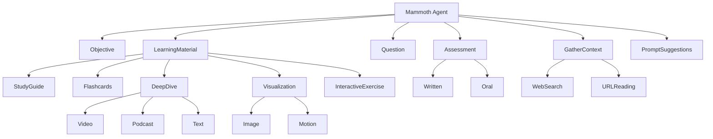

# Mammoth 

This is a personal research project exploring ways to build AI tutor agents that incorporate pedagogical best practices and help students develop durable knowledge they can apply independently.

📌 **Demo Website:** [tutorchat.noahbjorner.com](https://tutorchat.noahbjorner.com) – Try it for free.

✍️ **Related Writing:** [Rethinking ChatGPT for Learning](https://edu.noahbjorner.com/blog/rethinking-chatgpt-for-learning) – Context for the ideas behind this project.

## Status

This project is still in an early experimental stage and is not production-ready. The current code includes a few initial tools, but the agent architecture and overall code quality still need significant work.

The next step is to define a more complete initial toolset, structure the agent around it, and clean up the implementation into a usable first version. Once that foundation is in place, I plan to organize the project more clearly and document the main engineering decisions behind it.

## Authentication

Mammoth routes require a Supabase access token in the
`Authorization: Bearer <token>` header. The server verifies ES256 tokens against
the project's public JWKS and uses the verified `sub` claim as the user ID.

Required backend environment variables:

- `SUPABASE_URL`
- `SUPABASE_PUBLISHABLE_KEY`
- `SUPABASE_SECRET_KEY` (server only; never expose it to the iOS app)
- `SUPABASE_DB_URL` (migration tooling only)

Apply the migrations in `supabase/migrations` before serving Mammoth requests.
They create user profiles, subscription
entitlements, request logs, ownership policies, and the Auth user/profile sync
trigger.

Subscription enforcement is prepared but disabled by default. Set
`MAMMOTH_REQUIRE_ACTIVE_SUBSCRIPTION=true` only after the StoreKit entitlement
sync writes trusted rows to `subscription_entitlements`.

## Tool Architecture

## Author

Created by Noah Bjorner
- 📧 Email: bjornernoah@gmail.com
- 🛠 GitHub: @Noah-Bjorner

## License

This project is licensed under the MIT License - see the LICENSE file for details.
