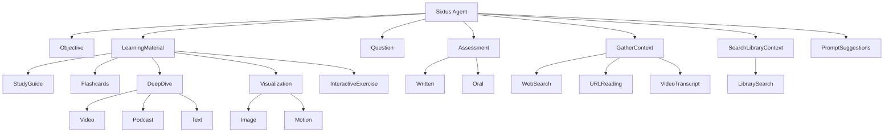

# Sixtus 

This is a personal research project exploring ways to build AI tutor agents that incorporate pedagogical best practices and help users develop durable knowledge they can apply independently.

📌 **Demo Website:** [sixtus.noahbjorner.com](https://tutorchat.noahbjorner.com) – Try it for free.

✍️ **Related Writing:** [Rethinking ChatGPT for Learning](https://edu.noahbjorner.com/blog/rethinking-chatgpt-for-learning) – Context for the ideas behind this project.

## ⚠️ Status 

> Last updated: June 25, 2026.

This project is still in an early experimental stage and is not production-ready. The current code includes a few initial tools, but the agent architecture and overall code quality still need significant work.

The next step is to define a more complete initial toolset, structure the agent around it, and clean up the implementation into a usable first version. Once that foundation is in place, I plan to organize the project more clearly and document the main engineering decisions behind it.

## Authentication

Sixtus routes require a Supabase access token in the
`Authorization: Bearer <token>` header. The server verifies ES256 tokens against
the project's public JWKS and uses the verified `sub` claim as the user ID.

Required backend environment variables:

- `SUPABASE_URL`
- `SUPABASE_PUBLISHABLE_KEY`
- `SUPABASE_SECRET_KEY` (server only; never expose it to the iOS app)
- `SUPABASE_DB_URL` (migration tooling only)

Apply the migrations in `supabase/migrations` before serving Sixtus requests.
They create the `users` table, subscription entitlements, ownership policies,
and the Auth user sync trigger. Each Auth user's email is copied into
`public.users`; the Supabase Auth UUID remains the stable user identifier.

Subscription enforcement is prepared but disabled by default. Set
`SIXTUS_REQUIRE_ACTIVE_SUBSCRIPTION=true` only after the StoreKit entitlement
sync writes trusted rows to `subscription_entitlements`.

## Citations

Sixtus stores citations in the chat transcript. There is no citation database and no server-side chat store.

1. Source-producing tools (`gatherContext`, `searchLibraryContext`) return `{ content, sources[] }`.
2. Each source has a server-generated `id` such as `src_callabc_1`, plus title, URL, and excerpt taken from the retrieval provider — not from the model.
3. AI SDK stores that object on the assistant message as a `tool-*` part. The client resends the same `UIMessage` history on later turns.
4. Learner-facing text cites with `<citation ref="SOURCE_ID" />`. The client should resolve a tag by scanning source-producing tool outputs in the same assistant message, then earlier messages.

Deleting a chat deletes its citations. This is reliable for normal app use. It is not tamper-proof: a client that edits old tool outputs can change stored source records. Server-authoritative citations would require persistence later.

Downloadable documents keep citations self-contained: valid `<citation>` tags are rewritten to `[1]` markers and a generated `## Sources` footer before upload.

## Tool Architecture

> Last updated: August 26, 2026. This diagram may be out of date.

## Author

Created by Noah Bjorner
- 📧 Email: bjornernoah@gmail.com
- 🛠 GitHub: @Noah-Bjorner

## License

This project is licensed under the MIT License - see the LICENSE file for details.
